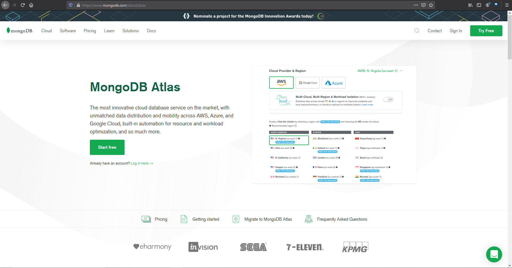
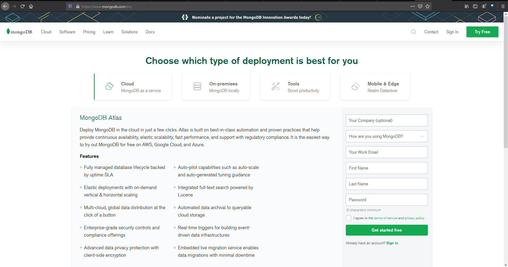
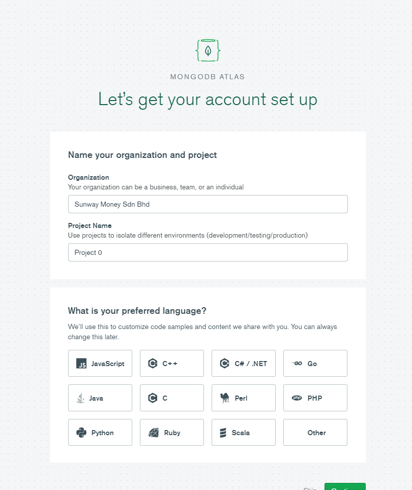
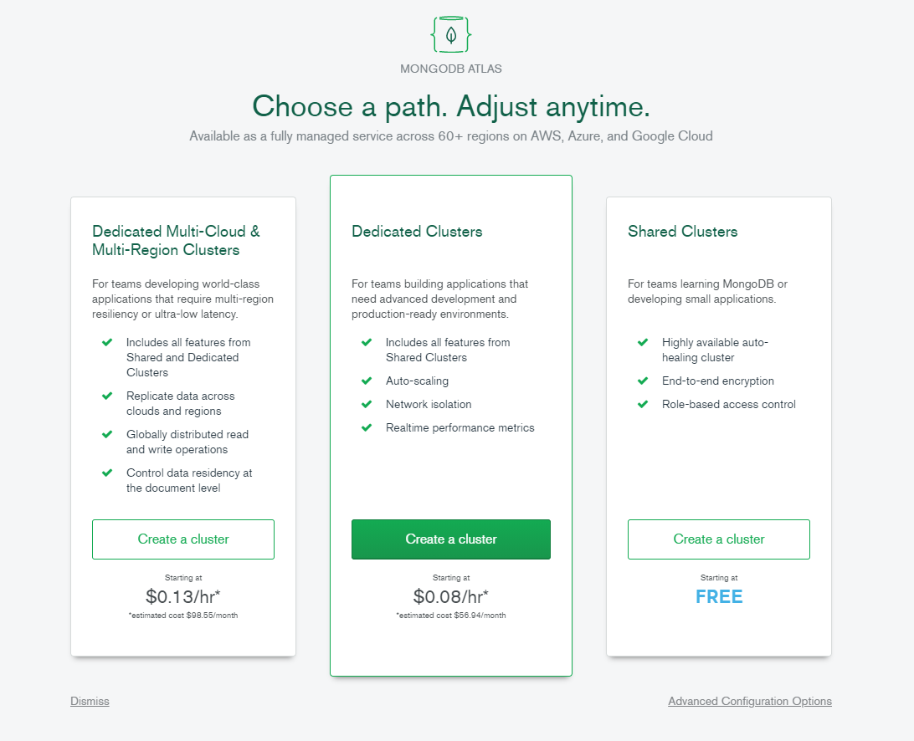
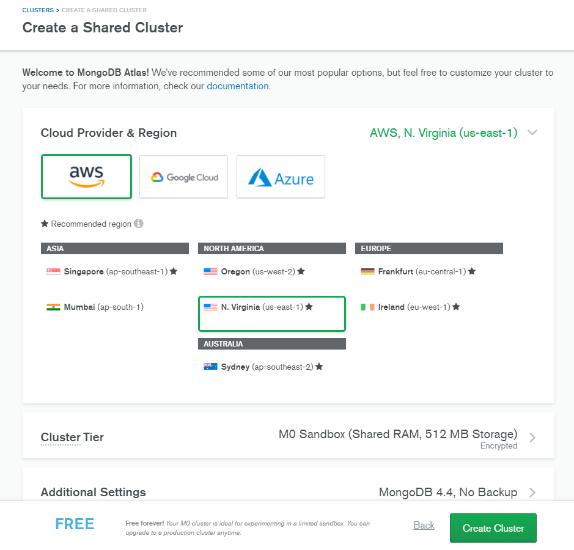
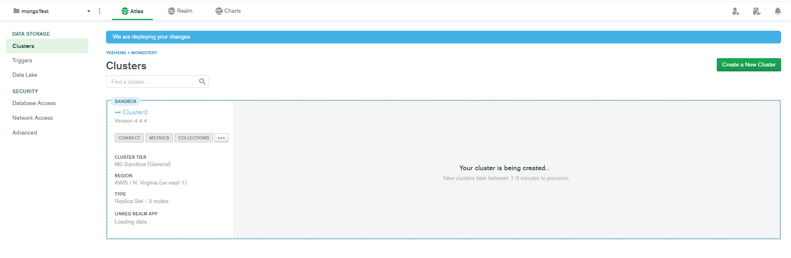
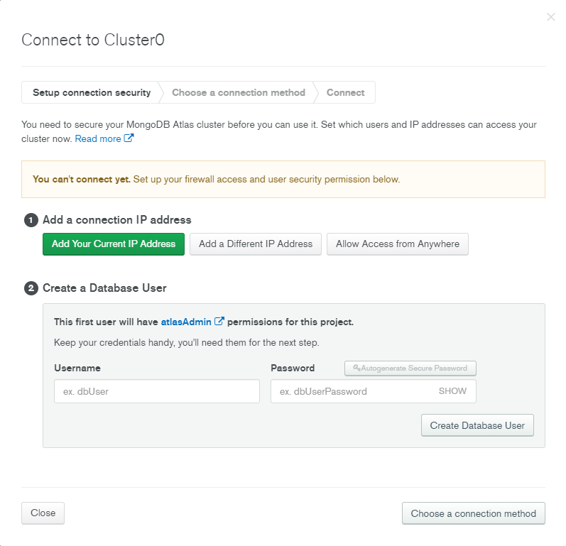
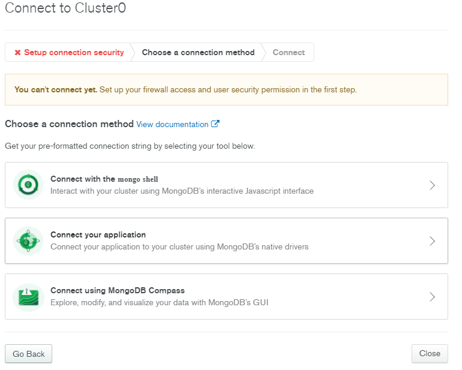
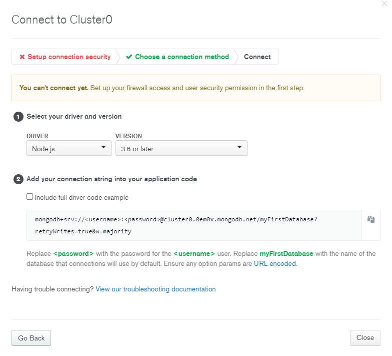

# Simple CRUD API Using Flask

This repo is the backend API that serve simple CRUD for user.
The API is written in Python language with Flask framework and using Mongodb
as the database.

## Setup

### Python

Make sure you have install python in your local machine.
Else please go to [python official website](https://www.python.org/)
to download the installer (for Windows and Mac user), while for Linux user
python is installed by default in the system.

Then check is the python package manager `pip`
is available in your or not by running `pip -v` in commandline (for Windows User)
or terminal (for Mac and Linux user). Then, open the commandline or terminal and change
the directory to the root folder of this project then run `pip install` to install
neccessary dependency as stated in `requirements.txt`. If you wish to separate the project dependency
from your python. you can use `pipenv` where you can use the following command:

```
pip install pipenv
pipenv shell
pipenv install
```

Pipenv will install the package that is stated in Pipfile.

### Database

Create an account in [Mongodb Atlas](https://www.mongodb.com/), then create a free
database in the website. The landing page of the Mongo Atlas is shown as below.

_Figure 1: Mongo Atlas Landing Page_

If you don't have the account, click on the _Try Free_ button to register.
Abd you will be redirecting to the register page as shown in Figure 2.

_Figure 2: Mongo Atlas Landing Page_

After fill in the required information, you will be redirect to the MongoDB
Atlas Setup page as shown in Figure 3.

_Figure 3: Mongo Atlas Language Setup Page_

Then you will be asked for choosing the package. As a demo project, choose the free cluster
package.

_Figure 4: Mongo Atlas Choose Package Page_

Then you will create a new MongoDB cluster at the page as shown in Figure 5. Just
create the cluster with the default configured value.

_Figure 5: Mongo Atlas Create Cluster Page_

Then you will redirect to the project page as shown in Figure 6.
Then click on _CONNECT_, to whitelist the IP address and create the user credential to
use the database, a modal page (Figure 7) will prompt you for the require information. As a demo project,
for the IP address you can put `0.0.0.0` for global access or just click on `Add Your Current IP Address`,
if you want to control the access of the database. Then input the username and the password that you will
be used to connect to the database. Next, get the MongoDB URI by clicking on the `Choose a connection method` button.
Click on `Connect your application`, select the Driver (which programming language you are using), this case will be
Python, then select version 3.6 or later. Then the URI is shown, copy it and paste it to `config/conf.py`.
The general URI to connect to MongoDB atlas is `mongodb+srv://<username>:<password>@cluster0.0em0x.mongodb.net/myFirstDatabase?retryWrites=true&w=majority`.
Do remember to replace <username> with the username that you create for the DB, as well as the password. also don't forget to replace myFirstDatabase with
the name of the database you want to use. In this case, I am naming it as _user_.

_Figure 6: Mongo Atlas Create Cluster Page_


_Figure 7: Add IP Address and White list IP Address_


_Figure 8: Choose Connection Method_


_Figure 9: Select Programming Language to Connect The Database_

## Unit Testing

The test case are locate in `test` folder. The command to run the test is `python -m unittest --buffer`.
Sample output:

```bash
user@host:~$ python -m unittest --buffer
....
----------------------------------------------------------------------
Ran 4 tests in 1.497s

OK
```

## API Documentation

The documentation for this api can be found on https://documenter.getpostman.com/view/9794957/TzJoDfYs.

## Notes

The URI in the `config/conf.py` is just an example, do change it to the database that you are using currently.
